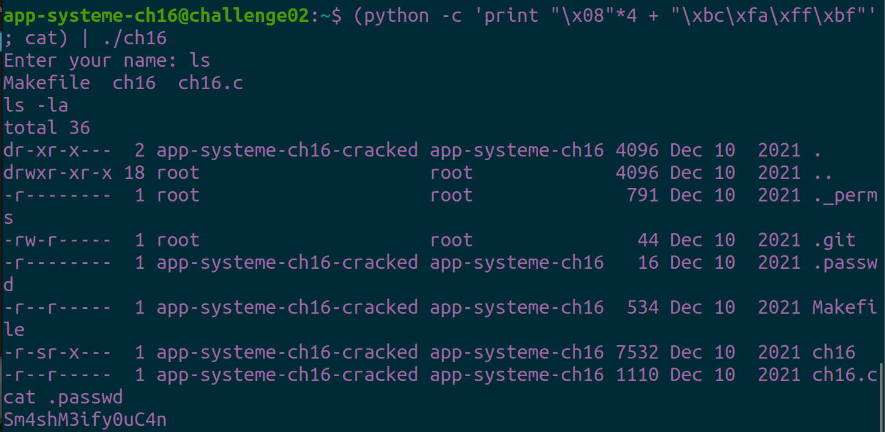

# Bandit

## Level 0

ssh bandit0@bandit.labs.overthewire.org -p 2220&#x20;

username : bandit0

password : bandit0

<figure><figcaption></figcaption></figure>

<figure><figcaption></figcaption></figure>

`cat readme` để lấy password

**password : NH2SXQwcBdpmTEzi3bvBHMM9H66vVXjL**

## &#x20;Level 1

để đọc đươc password trong file - ta có thể sử dụng lệnh `cat ./-`

[source](https://stackoverflow.com/questions/42187323/how-to-open-a-dashed-filename-using-terminal)&#x20;

<figure><figcaption></figcaption></figure>

**pasword : rRGizSaX8Mk1RTb1CNQoXTcYZWU6lgzi**

## Level 2

Ở level này ta dùng \ để cmd hiểu ký tự sau là space nên ta đọc password theo câu lệnh&#x20;

\=> `cat spaces\ in\ this\ filename`

<figure><figcaption></figcaption></figure>

**password : aBZ0W5EmUfAf7kHTQeOwd8bauFJ2lAiG**

## Level 3

Ở level này ta sẽ đọc password trong 1 file ẩn&#x20;

Đầu tiên ta `cd inhere` sau đó `ls -la` để xem có file ẩn không và thấy .hidden sau đó ta chỉ việc `cat .hidden` thôi

<figure><figcaption></figcaption></figure>

**password : 2EW7BBsr6aMMoJ2HjW067dm8EgX26xNe**

## **Level 4**

Ở level này đề nói password nằm trong 1 file có thể đọc được nên ta sẽ làm như sau

Đầu tiên ta sẽ vào thư mục inhere `cd inhere` sau đó dùng lệnh file để kiểm tra tất cả file => `file ./-f*`

<figure><figcaption></figcaption></figure>

Ta sẽ thất -file07 là 1 file ASCII text nên ta sẽ đọc file đó

**password : lrIWWI6bB37kxfiCQZqUdOIYfr6eEeqR**

## Level 5

Đề gợi ý cho ta là password nằm ở file có size 1033c nên ta sẽ dùng lệnh `find -type f -size 1033c` với **-type f** để tìm tất cả file và **-size 1033c** để tìm tất cả file có size 1033c

<figure><figcaption></figcaption></figure>

**password : P4L4vucdmLnm8I7Vl7jG1ApGSfjYKqJU**

## Level 6

Level này đề cho user là bandit7 , group bandit6 và size 33 nên ta sẽ sử dụng lệnh&#x20;

find / -user bandit7 -group bandit6 -size 33c&#x20;

Nhưng ở đây ta sẽ bị rất nhiều Permission denied&#x20;

<figure><figcaption></figcaption></figure>

Nên ta sẽ thêm vào câu lệnh 2>/dev/null ([source](https://www.cyberciti.biz/faq/bash-find-exclude-all-permission-denied-messages/))

\=> find / -user bandit7 -group bandit6 -size 33c 2>/dev/null

<figure><figcaption></figcaption></figure>

**password : z7WtoNQU2XfjmMtWA8u5rN4vzqu4v99S**

## Level 7

The password for the next level is stored in the file **data.txt** next to the word **millionth**

Đề bảo password nằm kế với từ millionth thì ta chỉ việc lấy password bằng câu lệnh&#x20;

\=> `cat data.txt | grep millionth`&#x20;

<figure><figcaption></figcaption></figure>

**password : TESKZC0XvTetK0S9xNwm25STk5iWrBvP**

## **Level 8**

Bài này đề nói password chỉ xuất hiện 1 lần nên khi ta dùng lệnh `sort data.txt` sẽ thấy rất nhiều password lặp laị như sau

<figure><figcaption></figcaption></figure>

Nên lúc này để tìm được password thì chỉ cần tìm 1 chuỗi xuất hiện 1 lần bằng câu lệnh&#x20;

\=> `sort data.txt  |  uniq -u` ( -u chỉ hiển thị các dòng không lặp lại [source](https://vi.wikipedia.org/wiki/Uniq\_\(Unix\)) )

<figure><figcaption></figcaption></figure>

**password : EN632PlfYiZbn3PhVK3XOGSlNInNE00t**

## Level 9

The password for the next level is stored in the file **data.txt** in one of the few human-readable strings, preceded by several ‘=’ characters.

Khi đọc file data.txt thì ta sẽ thấy đây là 1 file không thể đọc . Nên ta sẽ thử dùng câu lệnh strings mà trên đề đã nói password có 1 vài dấu = .Nên ở trường hợp này ta có:

\=> `strings data.txt | grep ==`&#x20;

<figure><figcaption></figcaption></figure>

**password : G7w8LIi6J3kTb8A7j9LgrywtEUlyyp6s**

## Level 10

The password for the next level is stored in the file **data.txt**, which contains base64 encoded data

Bài này thì chỉ cần decode base64 là có password&#x20;

\=> `cat data.txt | base64 --decode`

<figure><figcaption></figcaption></figure>

**password : 6zPeziLdR2RKNdNYFNb6nVCKzphlXHBM**

## Level 11

The password for the next level is stored in the file **data.txt**, where all lowercase (a-z) and uppercase (A-Z) letters have been rotated by 13 positions

Bài này cũng chỉ đơn giản là decode ROT13 để có password&#x20;

\=> `cat data.txt | tr 'A-Za-z' 'N-ZA-Mn-za-m'`

<figure><figcaption></figcaption></figure>

**password : JVNBBFSmZwKKOP0XbFXOoW8chDz5yVRv**

## Level 12

The password for the next level is stored in the file **data.txt**, which is a hexdump of a file that has been repeatedly compressed. For this level it may be useful to create a directory under /tmp in which you can work using mkdir. For example: mkdir /tmp/myname123. Then copy the datafile using cp, and rename it using mv (read the manpages!)

Đầu tiên ta sẽ tạo 1 thư mục để xử lý trên nó sau đó hexdump nó thành 1 file như hình

<figure><figcaption></figcaption></figure>

Việc bây giờ là format lại file cho đúng định dạng có thể đọc được

Ta sẽ có quy tác như sau :&#x20;

\+ Nếu file đó là gzip thì ta cần chuyển nó thành file với đuôi gz và sử dụng câu lệnh `gunzip` để giải nén

\+ Nếu  bzip2 thì chỉ cần dùng câu lệnh `bzip2 -d`&#x20;

\+ Nêu là POSIX thì dùng câu lệnh `tar xvf`&#x20;

<figure><figcaption></figcaption></figure>

**password : wbWdlBxEir4CaE8LaPhauuOo6pwRmrDw**

## Level 13

The password for the next level is stored in **/etc/bandit\_pass/bandit14 and can only be read by user bandit14**. For this level, you don’t get the next password, but you get a private SSH key that can be used to log into the next level. **Note:** **localhost** is a hostname that refers to the machine you are working on

Để connect vào bandit14 khi đã có private key ta thực hiện câu lệnh sau

`ssh bandit14@localhost -i sshkey.private -p 2220`

<figure><figcaption></figcaption></figure>

<figure><figcaption></figcaption></figure>

password bandit14 đề cho nằm trong /etc/bandit\_pass/bandit14

**password : fGrHPx402xGC7U7rXKDaxiWFTOiF0ENq**

## Level 14

The password for the next level can be retrieved by submitting the password of the current level to **port 30000 on localhost**.

nc 127.0.0.1 30000

password là pass level14

<figure><figcaption></figcaption></figure>

**password : jN2kgmIXJ6fShzhT2avhotn4Zcka6tnt**

## Level 15

The password for the next level can be retrieved by submitting the password of the current level to **port 30001 on localhost** using SSL encryption.

**Helpful note: Getting “HEARTBEATING” and “Read R BLOCK”? Use -ign\_eof and read the “CONNECTED COMMANDS” section in the manpage. Next to ‘R’ and ‘Q’, the ‘B’ command also works in this version of that command…**

Bài này sử dụng openssl để connect vào localhost port 30001

Ta thực hiện như sau ([source here](https://www.mkssoftware.com/docs/man1/openssl\_s\_client.1.asp))

`openssl s_client -connect localhost:30001`

password là pass level trước

<figure><figcaption></figcaption></figure>

**password : JQttfApK4SeyHwDlI9SXGR50qclOAil1**

## Level 16

The credentials for the next level can be retrieved by submitting the password of the current level to **a port on localhost in the range 31000 to 32000**. First find out which of these ports have a server listening on them. Then find out which of those speak SSL and which don’t. There is only 1 server that will give the next credentials, the others will simply send back to you whatever you send to it.

Đầu tiên ta sử dụng lệnh nmap để scan các port từ 31000-32000 và thấy port 31709 có thể khai thác được : `nmap -sV -p 31000-32000 localhost`

<figure><figcaption></figcaption></figure>

<figure><figcaption></figcaption></figure>

sử dụng `openssl s_client -connect localhost:31790` với password của level trước

<figure><figcaption></figcaption></figure>

Ta sẽ có đuợc private key tiếp đó chỉ cần dùng ssh với private key để connect vào level 17 lấy pasword thực hiện như sau

`chmod 400 key.private`

`chmod 600 key.private`

`sudo ssh bandit17@bandit.labs.overthewire.org -p 2220 -i key.private`

`cat /etc/bandit_pass/bandit17`

<figure><figcaption></figcaption></figure>

<figure><figcaption></figcaption></figure>

**password : VwOSWtCA7lRKkTfbr2IDh6awj9RNZM5e**

## **Level 17**

There are 2 files in the homedirectory: **passwords.old and passwords.new**. The password for the next level is in **passwords.new** and is the only line that has been changed between **passwords.old and passwords.new**

Bài này ta sẽ dùng diff để so sánh 2 file passwords.new với passwords.old để xem password nào đã bị thay đổi

\=> `diff passwords.old passwords.new`

<figure><figcaption></figcaption></figure>

**password : hga5tuuCLF6fFzUpnagiMN8ssu9LFrdg**

## Level 18

The password for the next level is stored in a file **readme** in the homedirectory. Unfortunately, someone has modified **.bashrc** to log you out when you log in with SSH.

Đầu tiên ta sẽ sử dụng man ssh để xem các flag có thể sử dụng trong ssh và ta thấy -t sẽ thay đổi pseudo-terminal nên ta sẽ dùng /bin/sh để connect thay vì bash và bị kick

<figure><figcaption></figcaption></figure>

<figure><figcaption></figcaption></figure>

**password : awhqfNnAbc1naukrpqDYcF95h7HoMTrC**

## **Level 19**

To gain access to the next level, you should use the setuid binary in the homedirectory. Execute it without arguments to find out how to use it. The password for this level can be found in the usual place (/etc/bandit\_pass), after you have used the setuid binary.

Khi ta thử chạy file bandit20-do thì sẽ hiển thị ra như sau vì id đang là bandit19 đề yêu cầu là sywr dụng bandit20&#x20;

<figure><figcaption></figcaption></figure>

Ta sẽ vào thử directory /etc/bandit\_pass và thấy rất nhiều bandit tiếp theo dùng `ls -la | grep bandit20` để xem id của bandit20 xem có đúng không

<figure><figcaption></figcaption></figure>

Như vậy để đọc được password ta sẽ thực hiện câu lệnh ./bandit20-do id

\=> `./bandit20-do cat /etc/bandit_pass/bandit20`

<figure><figcaption></figcaption></figure>

**password : VxCazJaVykI6W36BkBU0mJTCM8rR95XT**

## Level 2​0

There is a setuid binary in the homedirectory that does the following: it makes a connection to localhost on the port you specify as a commandline argument. It then reads a line of text from the connection and compares it to the password in the previous level (bandit20). If the password is correct, it will transmit the password for the next level (bandit21).

Bài này ./suconnect sẽ gửi password của nextlevel vào port localhost nên ta sẽ host 1 cái với port bất kỳ để bắt password

`=> nc -lnvp 6969 ( gửi password cũ ở đây)`

`=> ./suconnect 6969`

<figure><figcaption></figcaption></figure>

<figure><figcaption></figcaption></figure>

**password : NvEJF7oVjkddltPSrdKEFOllh9V1IBcq**

****

## **Level 21**

A program is running automatically at regular intervals from **cron**, the time-based job scheduler. Look in **/etc/cron.d/** for the configuration and see what command is being executed.

Ta sẽ đi vào thư mục /etc/con.d xem có gì trong đó

<figure><figcaption></figcaption></figure>

Thử cat file cronjob\_bandit22 xem sao

<figure><figcaption></figcaption></figure>

<figure><figcaption></figcaption></figure>

Vậy có nghĩa là conjob\_bandit22 sẽ được mở lên khi khởi động hệ điều hành ( reboot)&#x20;

ta sẽ xem thử trong file /usr/bin/cronjob\_bandit22.sh có gì&#x20;

<figure><figcaption></figcaption></figure>

Ta sẽ thấy nó cấp quyền cho file /tmp/t7... và truyền password của bandit22 vào file đó nên chắc chắn sẽ có mật khẩu ở trong file /tmp/t7..

<figure><figcaption></figcaption></figure>

**password : WdDozAdTM2z9DiFEQ2mGlwngMfj4EZff**

## Level 22

A program is running automatically at regular intervals from **cron**, the time-based job scheduler. Look in **/etc/cron.d/** for the configuration and see what command is being executed.

**NOTE:** Looking at shell scripts written by other people is a very useful skill. The script for this level is intentionally made easy to read. If you are having problems understanding what it does, try executing it to see the debug information it prints.

Tương tự level 21 ta sẽ xem thử trong file sh có gì

<figure><figcaption></figcaption></figure>

Giải thích làm sao để lấy dược password ở đây theo mình nghĩ thì ta sẽ lấy được đường dẫn đến file chứa password sẽ là bằng biến mytarget mà biến mytarget sẽ được set là (echo I am user $myname | md5sum | cut -d  ' ' -f 1) mà myname sẽ là bandit23 nên ta sẽ test như sau

<figure><figcaption></figcaption></figure>

Vậy mytarget sẽ là : 8ca319486bfbbc3663ea0fbe81326349

cat /tmp/8ca319486bfbbc3663ea0fbe81326349 để đọc password thôi

<figure><figcaption></figcaption></figure>

**password : QYw0Y2aiA672PsMmh9puTQuhoz8SyR2G**

## Level 23

A program is running automatically at regular intervals from **cron**, the time-based job scheduler. Look in **/etc/cron.d/** for the configuration and see what command is being executed.

**NOTE:** This level requires you to create your own first shell-script. This is a very big step and you should be proud of yourself when you beat this level!

**NOTE 2:** Keep in mind that your shell script is removed once executed, so you may want to keep a copy around…

Tương tự 2 level trước ta đọc file sh&#x20;

<figure><figcaption></figcaption></figure>

Đầu tiên nó sẽ cd vào /var/spool/$myname/foo ($myname sẽ là bandit24), vòng lặp for lúc này sẽ lấy tất cả các file trong địa chỉ đó để thực hiện vòng lặp. Sau đó sẽ duyệt tất cả các file thuộc quyền sở hữu của bandit23 ( timeout 90s ) sau đó xóa luôn file

Lúc này để giải được level này ta cần tạo 1 file bash với nội dung truyền password vào 1 file nào đó ở bên ngoài để lấy được password&#x20;

`#!/bin/bash`&#x20;

`cat /etc/bandit_pass/bandit24 > /tmp/pass_j1s0o/pw`

<figure><figcaption></figcaption></figure>

<figure><figcaption>
cấp quyền cho j1s0o
</figcaption></figure>

<figure><figcaption></figcaption></figure>

**password : VAfGXJ1PBSsPSnvsjI8p759leLZ9GGar**

## Level 24

A daemon is listening on port 30002 and will give you the password for bandit25 if given the password for bandit24 and a secret numeric 4-digit pincode. There is no way to retrieve the pincode except by going through all of the 10000 combinations, called brute-forcing.

Bài này chỉ cần brute force 4 số có 4 chữ số vì ta thấy khi nhập sai thì nc ko tự ngắt kết nối nên câu này cũng dễ bruteforce

ta sẽ viết bash script như sau

<figure><figcaption></figcaption></figure>

Chạy file sh ta sẽ được file solve.txt tiếp theo ta lấy password thôi&#x20;

nc localhost 30002 < solve.txt

<figure><figcaption></figcaption></figure>

<figure><figcaption></figcaption></figure>

**password : p7TaowMYrmu23Ol8hiZh9UvD0O9hpx8d**

****

## **Level 25**

Logging in to bandit26 from bandit25 should be fairly easy… The shell for user bandit26 is not **/bin/bash**, but something else. Find out what it is, how it works and how to break out of it.

<figure><figcaption></figcaption></figure>

Ta thử dùng key này để vào bandit26 nhưng bị kick ra

<figure><figcaption></figcaption></figure>

Xem thử bandit26 dùng shell gì vì đề bảo shell bandit26 không phải /bin/bash

<figure><figcaption></figcaption></figure>

Vậy shell ở đây là /bin/showtext nên ta thử cat xem có gì trong đó

<figure><figcaption></figcaption></figure>

Theo mình thấy nó sẽ thực hiện lệnh more \~/text.txt rồi exit nên ta xem lệnh more dùng để làm gì

<figure><figcaption></figcaption></figure>

Lênh more sẽ đọc text nhưng khi này text quá dài nên nó sẽ kick mình ra nên lúc này ta sẽ kéo size của terminal nhỏ lại để bypass được

&#x20;

<figure><figcaption></figcaption></figure>

Đã vào được bên trong more tiếp theo  ta sẽ  :

Sử dụng h vào được help

<figure><figcaption></figcaption></figure>

Tiếp theo dùng v để vào vim

<figure><figcaption></figcaption></figure>

Sau đó trong vim sẽ có terminal để ta cat được password

<figure><figcaption></figcaption></figure>

<figure><figcaption></figcaption></figure>

**password : c7GvcKlw9mC7aUQaPx7nwFstuAIBw1o1**

## Level 26

Good job getting a shell! Now hurry and grab the password for bandit27!

Vào bandit26 giống với trên bandit25 thay vì dùng key thì dùng password lặp lại các bước bên trên sau đó ta sẽ set shell của bandit26 thành /bin/bash

<figure><figcaption></figcaption></figure>

<figure><figcaption></figcaption></figure>

<figure><figcaption></figcaption></figure>

Lúc này shell bandit26 sẽ thành /bin/bash ta sẽ xem thử pass level 27 ở đâu

<figure><figcaption></figcaption></figure>

Nice bây giờ ta sẽ đọc password giống với level19

<figure><figcaption></figcaption></figure>

**password : YnQpBuifNMas1hcUFk70ZmqkhUU2EuaS**

## Level 27

There is a git repository at `ssh://bandit27-git@localhost/home/bandit27-git/repo`. The password for the user `bandit27-git` is the same as for the user `bandit27`.

Clone the repository and find the password for the next level.

Bài này ý tưởng là sẽ sử dụng git clone để đọc password trong 1 repo trên github

Đầu tiên ta sẽ vào bên trong /tmp/j1s0\_pass để có quyền tải file

<figure><figcaption></figcaption></figure>

Sau đó ta sẽ thực hiện git clone ở đây nhớ thêm port 2220 mặc định của các challage&#x20;

<figure><figcaption></figcaption></figure>

<figure><figcaption></figcaption></figure>

Đã git clone thành công và giờ xem password nằm đâu thôi

<figure><figcaption></figcaption></figure>

**password : AVanL161y9rsbcJIsFHuw35rjaOM19nR**

## Level 28

There is a git repository at `ssh://bandit28-git@localhost/home/bandit28-git/repo`. The password for the user `bandit28-git` is the same as for the user `bandit28`.

Clone the repository and find the password for the next level

Cùng thực hiện giống với level trước xem có gì nào

<figure><figcaption></figcaption></figure>

Password đã bị che rồi nên check xem git log có gì&#x20;

<figure><figcaption></figcaption></figure>

Ta thấy có 1 commit để fix lộ password nên ta sẽ dùng git diff để check xem đã sửa đổi cái gì ở commit đó

<figure><figcaption></figcaption></figure>

Và giờ ta đã thấy được password trước khi bị sửa

**password : tQKvmcwNYcFS6vmPHIUSI3ShmsrQZK8S**

## Level 29

There is a git repository at `ssh://bandit29-git@localhost/home/bandit29-git/repo`. The password for the user `bandit29-git` is the same as for the user `bandit29`.

Clone the repository and find the password for the next level.

Nhìn giống bị dejavu quá nên ta sẽ làm theo các bước ở level 28

<figure><figcaption></figcaption></figure>

Không có gì liên quan đến password ở đây cả nên ta check xem ở các branch khác có gì không&#x20;

<figure><figcaption></figcaption></figure>

1 đống branch luôn . Sử dụng lệnh git checkout và git log  để xem trong mấy branch đó có cái nào có pass không&#x20;

Sau một hồi git checkout git log và git diff ta thấy trong remotes/origin/dev sẽ có password

<figure><figcaption></figcaption></figure>

<figure><figcaption></figcaption></figure>

**password : xbhV3HpNGlTIdnjUrdAlPzc2L6y9EOnS**

## Level 30

There is a git repository at `ssh://bandit30-git@localhost/home/bandit30-git/repo`. The password for the user `bandit30-git` is the same as for the user `bandit30`.

Clone the repository and find the password for the next level.

Ơ kìa lại nữa à . Tiếp tục làm như level 29 nào

<figure><figcaption></figcaption></figure>

password : just an epmty file... muahaha

À nhầm để làm tiếp

&#x20;

<figure><figcaption></figcaption></figure>

Chả có gì ở đây hết . Nên ta sẽ spam các lệnh của git xem sao

Ở đây ta sẽ thấy có 1 lệnh là tag&#x20;

<figure><figcaption></figcaption></figure>

<figure><figcaption></figcaption></figure>

Có 1 file tên secret có khả năng là password dùng git show để đọc thui

<figure><figcaption></figcaption></figure>

**passwod : OoffzGDlzhAlerFJ2cAiz1D41JW1Mhmt**

## Level 31

here is a git repository at `ssh://bandit31-git@localhost/home/bandit31-git/repo`. The password for the user `bandit31-git` is the same as for the user `bandit31`.

Clone the repository and find the password for the next level.

Làm theo các bước giống level 30

<figure><figcaption></figcaption></figure>

Nó bảo ta phải push lên master 1 cái file tên key.txt với content là 'May I come in?'

<figure><figcaption></figcaption></figure>

<figure><figcaption></figcaption></figure>

Rồi luôn bị ban luôn nó hint cho ta sử dụng -f để force nó add vào&#x20;

<figure><figcaption></figcaption></figure>

Đã add thành công giờ chúng ta push nó lên thôi

<figure><figcaption></figcaption></figure>

<figure><figcaption></figcaption></figure>

**password : rmCBvG56y58BXzv98yZGdO7ATVL5dW8y**

## Level 32

